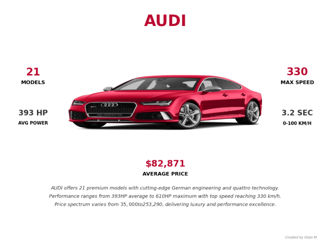
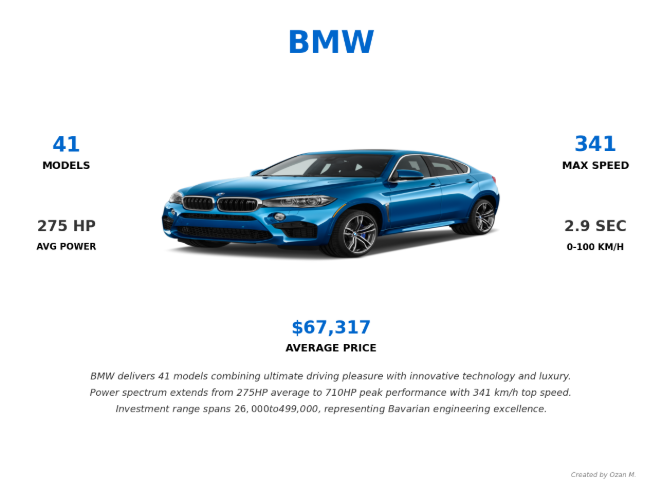
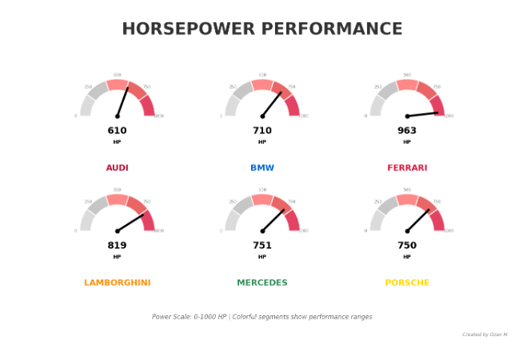

# Araba Performans Analizi 🚗

Araba performans metrikleri, marka karşılaştırmaları ve pazar içgörüleri üzerine kapsamlı bir veri analizi ve görselleştirme projesi.

## 📊 Proje Genel Bakış

Bu proje otomotiv verilerini analiz ederek şu konularda içgörüler sağlar:
- Marka performans karşılaştırmaları
- Hız ve beygir gücü analizleri
- Fiyat aralığı çeşitliliği
- Yakıt türü dağılımları
- Pazar konumlandırma analizleri

## 🔗 Kaggle Defteri

**Canlı Analiz:** [Kaggle'da Araba Performans Analizi](https://www.kaggle.com/code/analyticaobscura/car-performance-analysis)

## 📈 Örnek Görselleştirmeler

### Marka Performans Kartları
Her marka için anahtar metrikler ve özelliklerle birlikte bireysel marka analiz kartları:

#### AUDI Performans Kartı

#### BMW Performans Kartı  

### Performans Karşılaştırma Panosu

## 🛠️ Özellikler

- **Etkileşimli Marka Kartları**: Her otomotiv markası için detaylı analiz
- **Performans Metrikleri**: Hız, beygir gücü, ivmelenme karşılaştırmaları
- **Fiyat Analizi**: Aralık çeşitliliği ve pazar konumlandırması
- **Yakıt Türü Dağılımı**: Çevresel etki içgörüleri
- **Özel Görselleştirmeler**: Gauge grafikleri, bar grafikleri ve ayna grafikleri

## 📋 Analiz Bileşenleri

1. **Hız Karşılaştırması**: Markalar arası maksimum hız analizi
2. **Beygir Gücü Analizi**: Güç performansı kıyaslaması  
3. **Fiyat Aralığı Çalışması**: Pazar segmentasyonu içgörüleri
4. **Yakıt Türü Dağılımı**: Teknoloji benimseme trendleri
5. **Marka Performans Kartları**: Bireysel marka derinlemesine analizleri

## 🎨 Görselleştirme Türleri

- Performans metrikleri için Gauge Grafikleri
- Karşılaştırmalar için Yatay Bar Grafikleri
- Fiyat analizi için Ayna Bar Grafikleri
- Dağılımlar için Nokta Grafikleri
- Entegre analitiklerle Özel Marka Kartları

## 💾 Veri Kaynakları

Analiz şu otomotiv performans verilerini kullanır:
- Marka özellikleri
- Performans metrikleri (hız, ivmelenme, beygir gücü)
- Fiyatlandırma bilgileri
- Teknik özellikler
- Yakıt türü sınıflandırmaları

## 🚀 Başlangıç

1. [Kaggle defterini](https://www.kaggle.com/code/analyticaobscura/car-performance-analysis) ziyaret edin
2. Defteri kendi Kaggle hesabınıza fork edin
3. Görselleştirmeler oluşturmak için analiz hücrelerini çalıştırın
4. Özel analiz ihtiyaçlarınız için parametreleri özelleştirin

## 📝 Ana İçgörüler

- Farklı metrikler boyunca performans lideri belirlenmesi
- Fiyat-performans oranı analizi
- Marka konumlandırmasına göre pazar segmentasyonu
- Otomotiv endüstrisinde teknoloji benimseme trendleri
- Marka farklılaştırma stratejileri

## 👨‍💻 Yazar

**Ozan M.**  
Veri Analisti & Görselleştirme Uzmanı

---

*Detaylı analiz ve etkileşimli görselleştirmeler için tam [Kaggle defterini](https://www.kaggle.com/code/analyticaobscura/car-performance-analysis) inceleyin*
